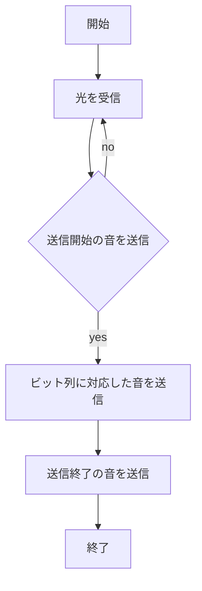

音の送信

```mermaid
flowchart TD;

st["開始"];
e["終了"];
receivelight["光を受信"];
sound["ビット列に対応した音を送信"];
soundend["送信終了の音を送信"];
ifsoundstart{"送信開始の音を送信"};


st --> receivelight
receivelight --> ifsoundstart
ifsoundstart -->|yes| sound
sound --> soundend
soundend --> e
ifsoundstart -->|no| receivelight

```