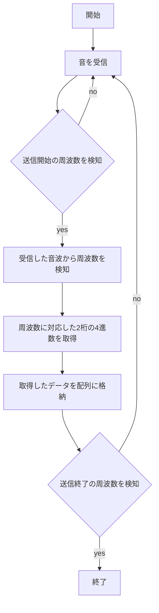

```mermaid
flowchart TD;

st["開始"];
e["終了"];
rcv_sound["音を受信"];
frec_detection["受信した音波から周波数を検知"];
if_detect_start{"送信開始の周波数を検知"};
get_num["周波数に対応した2桁の4進数を取得"];
store_num["取得したデータを配列に格納"];
if_detect_end{"送信終了の周波数を検知"}

st --> rcv_sound
rcv_sound --> if_detect_start
if_detect_start --> |yes| frec_detection
if_detect_start --> |no| rcv_sound
frec_detection --> get_num
get_num --> store_num
store_num --> if_detect_end
if_detect_end --> |yes| e
if_detect_end --> |no| rcv_sound

```