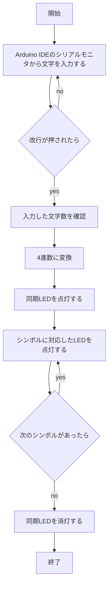

```mermaid
flowchart TD;

st["開始"];
e["終了"];
input["Arduino IDEのシリアルモニタから文字を入力する"];
if_enter{"改行が押されたら"};
check["入力した文字数を確認"];
base4["4進数に変換"];
sync_s["同期LEDを点灯する"];
led["シンボルに対応したLEDを点灯する"];
if_next{"次のシンボルがあったら"};
sync_e["同期LEDを消灯する"];

st --> input
input --> if_enter
if_enter --> |yes| check
if_enter --> |no| input
check --> base4
base4 --> sync_s
sync_s --> led
led --> if_next
if_next --> |yes| led
if_next --> |no| sync_e
sync_e --> e

```