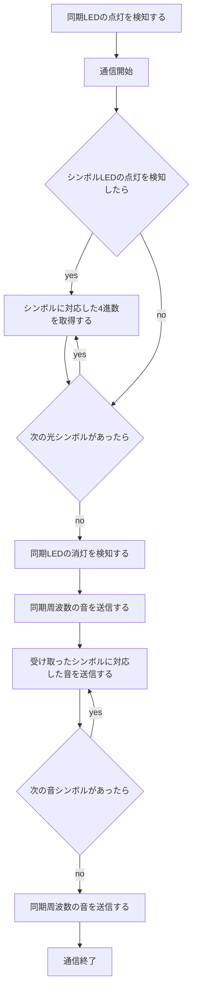

音の送信

```mermaid
flowchart TD;

st["通信開始"];
e["通信終了"];
lrcv_s["同期LEDの点灯を検知する"];
lrcv_e["同期LEDの消灯を検知する"]
if_symbol_rcv{"シンボルLEDの点灯を検知したら"};
get["シンボルに対応した4進数を取得する"];
if_next_l{"次の光シンボルがあったら"};

sync_s["同期周波数の音を送信する"]
sound["受け取ったシンボルに対応した音を送信する"];
if_next_s{"次の音シンボルがあったら"}
sound_end["同期周波数の音を送信する"];


lrcv_s --> st
st --> if_symbol_rcv
if_symbol_rcv --> |yes| get
get --> if_next_l
if_next_l --> |yes| get
if_next_l --> |no| lrcv_e

if_symbol_rcv --> |no| if_next_l


lrcv_e --> sync_s
sync_s --> sound
sound --> if_next_s
if_next_s --> |yes| sound
if_next_s --> |no| sound_end
sound_end --> e


```

