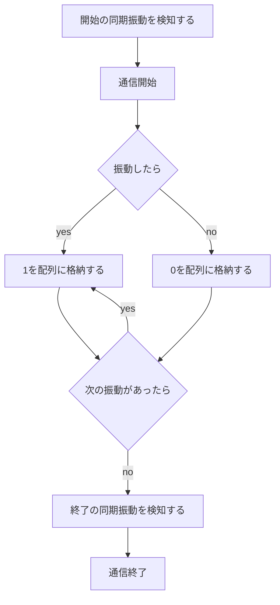

```mermaid
flowchart TD;

st["通信開始"];
e["通信終了"];
vrcv["開始の同期振動を検知する"];
if_vibrate{"振動したら"};
store1["1を配列に格納する"];
store0["0を配列に格納する"];
if_next{"次の振動があったら"};
vend["終了の同期振動を検知する"];


vrcv --> st
st --> if_vibrate
if_vibrate --> |yes| store1
store1 --> if_next
if_vibrate --> |no| store0
store0 --> if_next
if_next --> |yes| store1
if_next --> |no| vend
vend --> e

```