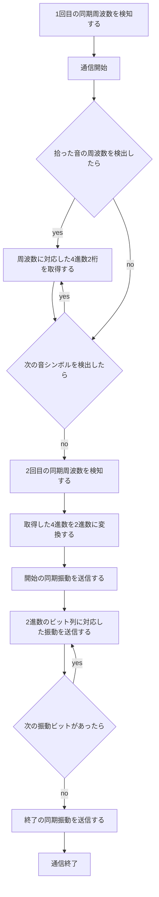

```mermaid
flowchart TD;

st["通信開始"];
e["通信終了"];
srcv["1回目の同期周波数を検知する"];
if_detect{"拾った音の周波数を検出したら"};
base4["周波数に対応した4進数2桁を取得する"];
if_next{"次の音シンボルを検出したら"};
srcv2["2回目の同期周波数を検知する"];
base2["取得した4進数を2進数に変換する"];

v_sync_s["開始の同期振動を送信する"];
vibrate["2進数のビット列に対応した振動を送信する"];
if_next_v{"次の振動ビットがあったら"};
v_sync_e["終了の同期振動を送信する"]


srcv --> st
st --> if_detect
if_detect --> |yes| base4
base4 --> if_next
if_detect --> |no| if_next
if_next --> |yes| base4
if_next --> |no| srcv2
srcv2 --> base2
base2 --> v_sync_s
v_sync_s --> vibrate
vibrate --> if_next_v
if_next_v --> |yes| vibrate
if_next_v --> |no| v_sync_e
v_sync_e --> e

```